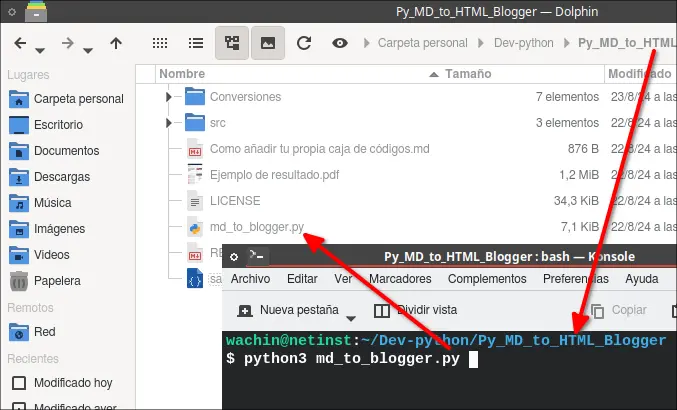
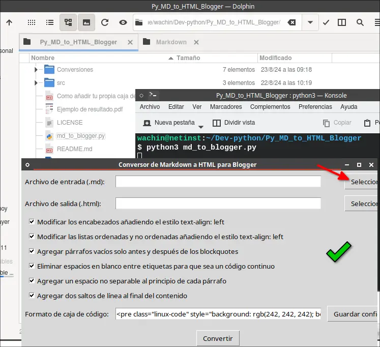
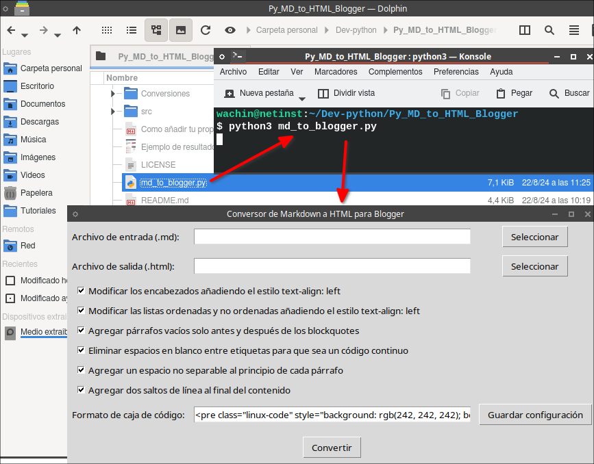
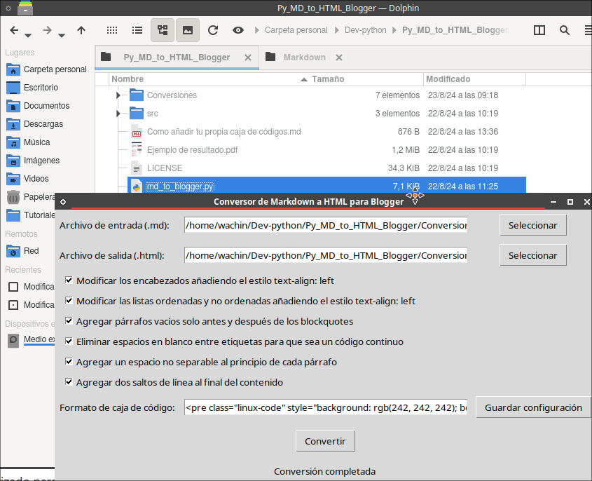
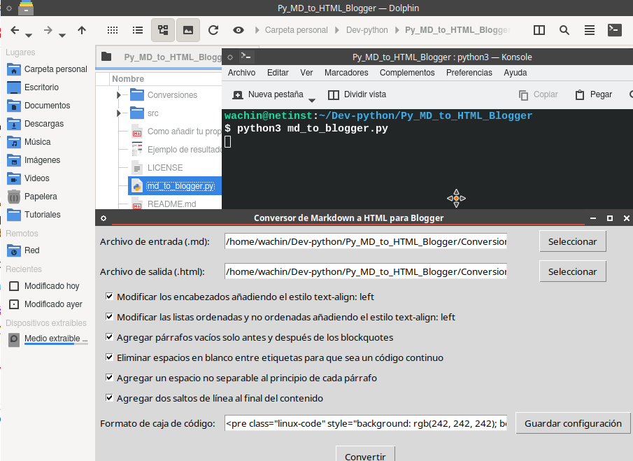

# Py_MD_to_HTML_Blogger | Manual de Usuario: Conversor de Markdown a HTML para Blogger


**Example of a bulleted list**

Autoimmune mechanism

* The bacteria could damege
* Current evidence.
* Damage your stomach.

The presence of H. pylori has not been established.

If you suspect that you have H. pylori and problems

**Example of a numbered list**

Limitations:

1. Variability in detection methods
2. Different criteria to define active RA
3. Possible uncontrolled confounders
4. Relatively small sample sizes in some studies

Lack of longitudinal follow-up

**Example of a paragraph**

This is a part 

of the text that 

I want to see 

**Example of a paragraph with a line break**

I hope that  
it  
always  
looks good  


esto en html para Blogger debe quedar así:

```html
<<p><b>Example of a bulleted list</b><br /><br />Autoimmune mechanism</p><ul style="text-align: left;"><li>The bacteria could damege</li><li>Current evidence.</li><li>Damage your stomach.</li></ul><p>The presence of H. pylori has not been established.<br /><br />If you suspect that you have H. pylori and problems<br /><br /><b>Example of a numbered list</b><br /><br />Limitations:<br /></p><ol style="text-align: left;"><li>Variability in detection methods</li><li>Different criteria to define active RA</li><li>Possible uncontrolled confounders</li><li>Relatively small sample sizes in some studies</li></ol><p>Lack of longitudinal follow-up<br /><br /><b>Example of a paragraph</b><br /><br />This is a part&nbsp;</p><p>of the text that&nbsp;</p><p>I want to see</p><p><b>Example of a paragraph with a line break</b><br /><br />I hope that<br />it<br />always<br />looks good<br /><br /></p>
```


## Descripción
Este programa convierte archivos Markdown (.md) a HTML optimizado para Blogger, incluyendo una caja de código personalizada.

## Requisitos Previos
Para sistemas Linux basados en Debian o Ubuntu, necesitas instalar las siguientes dependencias:

```
sudo apt install python3-bs4 python3-markdown python3-tk tk-dev
```

## Cuando conviarta cajas de codigo markdown a html debe borrar la etiqueta antes de convertir
1.- Cuando usted copie ejemplo una caja de codigo como la siguiente que tiene la etiqueta "python":

~~~~
```python
import requests

def check_requests():
    try:
```
~~~~

borrele el python para que quede así:

~~~~
```
import requests

def check_requests():
    try:
```
~~~~

porque de lo contrario la palabra python se pasará a la caja de código y si el que copia el código (pues este programa está dirigido a que otras personas copien en el Blog el tutorial y código de las cajas de código) copia esa palabra y la ejecuta ejemplo en un script ya no funcionará. 

lo mismo haga si ve la palabra "bash":

~~~~
```bash
#!/bin/bash

echo "¡Hola! ¿Cómo te llamas?"
read nombre
echo "Hola, $nombre. ¡Bienvenido al mundo de Bash!"
echo "La fecha y hora actual es: $(date)"
```
~~~~

o también "dos"

~~~~
```dos
@echo off
echo ¡Hola! ¿Cómo te llamas?
set /p nombre=Ingresa tu nombre: 
echo Hola, %nombre%. ¡Bienvenido al mundo de DOS!
echo La fecha y hora actual es: %date% %time%
pause

```
~~~~

etc.

borrelas porque después en la conversión se pasa al código.

2.- Cuando vea una lista que no esté hecha de viñetas y estén juntas las palabras, ejemplo:

/home/wachin/Descargas  
/home/wachin/Documentos  
/home/wachin/Escritorio  
/home/wachin/Música  
etc

al final de cada línea coloque dos espacios vaciós (aunque no se vea nada aquí están):

/home/wachin/Descargas  
/home/wachin/Documentos  
/home/wachin/Escritorio  
/home/wachin/Música  
etc  

porque sino le aparecerá así en línea:

/home/wachin/Descargas /home/wachin/Documentos /home/wachin/Escritorio /home/wachin/Música etc

Y esto también ocurrirá en Github, por eso es un buen consejo.

## Instalación
1. Asegúrate de tener Python 3 instalado en tu sistema.
2. Instala las dependencias mencionadas en los requisitos previos.
3. Descarga el script del conversor en tu computadora.

## Uso del Programa

### Inicio
1.) Abre una terminal en la carpeta donde se encuentra el script.

2.) Ejecuta el programa con el comando:

```
   python3 md_to_html_blogger.py
```

pongo una imagen para mejor entendimiento:



3.) Se abrirá una ventana con la interfaz gráfica del conversor:



acá otra imagen:



como muestra la imagen de clic en "Selección" y se abrirá automáticamente la carpeta "Conversiones" en la raíz del proyecto y debe buscar y cargar su archivo markdown .md 

**Archivo de salida (.html)**:

- El campo se llenará automáticamente con el mismo nombre del archivo de entrada, pero con extensión .html.
- Si deseas cambiarlo, haz clic en "Seleccionar" junto a "Archivo de salida (.html)".

### Opciones de Conversión
Puedes personalizar la conversión con las siguientes opciones que están aplicadas por defecto:

- [ ] Modificar los encabezados añadiendo el estilo text-align: left
- [ ] Modificar las listas ordenadas y no ordenadas añadiendo el estilo text-align: left
- [ ] Agregar párrafos vacíos solo antes y después de los blockquotes
- [ ] Eliminar espacios en blanco entre etiquetas para que sea un código continuo
- [ ] Agregar un espacio no separable al principio de cada párrafo
- [ ] Agregar dos saltos de línea al final del contenido

Desmarca las que no desees aplicar.

### Cómo añadir tu caja de códigos
En la sección:

Formato de caja de código:

Está puesta una caja de código que yo he dejado, la cual está guardada en el archivo:

save.json

Si usted desea usar otra caja en vez de la que yo he dejado, para cambiarla ejemplo la mía era así:

```
<pre class="linux-code" style="background: rgb(242, 242, 242); border-color: rgb(214, 73, 55); border-style: solid; border-width: 1px 1px 1px 20px; font-family: 'UbuntuBeta Mono', 'Ubuntu Mono', 'Courier New', Courier, monospace; font-size: small; line-height: 22.3999996185303px; margin: 10px; overflow: auto; padding: 10px; z-index: 10000;">
<code>escribe o pega
escribe o pega
escribe o pega</code></pre>
```

y cambié todo donde decía: escribe o pega escribe o pega escribe o pega por: {code} quedando así:

```
<pre class="linux-code" style="background: rgb(242, 242, 242); border-color: rgb(214, 73, 55); border-style: solid; border-width: 1px 1px 1px 20px; font-family: 'UbuntuBeta Mono', 'Ubuntu Mono', 'Courier New', Courier, monospace; font-size: medium; line-height: 22.3999996185303px; margin: 10px; overflow: auto; padding: 10px; z-index: 10000;">
<code>{code}</code></pre>
```

y dando clic en el botón:

Guardar configuración

### Proceso de Conversión
1. Una vez seleccionados los archivos y configuradas las opciones, haz clic en el botón "Convertir".
2. El programa procesará el archivo Markdown y generará el HTML correspondiente.
3. Cuando la conversión se complete (es muy rapida), verás el mensaje "Conversión completada" en la parte inferior de la ventana.



repito la captura:


también añado una captura por Shutter:



### Resultado

- El archivo HTML generado se guardará en la ubicación especificada en "Archivo de salida (.html)".
- Este archivo estará optimizado para su uso en Blogger, incluyendo una caja de código personalizada para los bloques de código.

## Características Especiales
- **Caja de Código Personalizada**: Los bloques de código en el Markdown se convertirán en una caja de código con estilo personalizado para Blogger.
- **Conversión de Texto entre Acentos Graves**: El texto entre acentos graves (`) se convertirá a negrita en HTML.

## Solución de Problemas
- Si encuentras algún error, asegúrate de que todas las dependencias estén correctamente instaladas.
- Verifica que los archivos de entrada estén en formato Markdown (.md) válido.

## Notas Adicionales
- Es recomendable revisar el HTML generado antes de publicarlo en Blogger para asegurarte de que el formato sea el deseado.
- Para cualquier problema o sugerencia, por favor contacta al desarrollador.

---

Este manual proporciona una guía completa para que los usuarios puedan instalar, configurar y utilizar este programa de conversión de Markdown a HTML para Blogger. Puedes ajustar o expandir cualquier sección según las necesidades específicas

Dios les bendiga

# Consultas

**markdowntohtml.com**
[https://markdowntohtml.com/](https://markdowntohtml.com/)

**Markdown Cheatsheet**  
[https://github.com/adam-p/markdown-here/wiki/Markdown-Cheatsheet](https://github.com/adam-p/markdown-here/wiki/Markdown-Cheatsheet)
