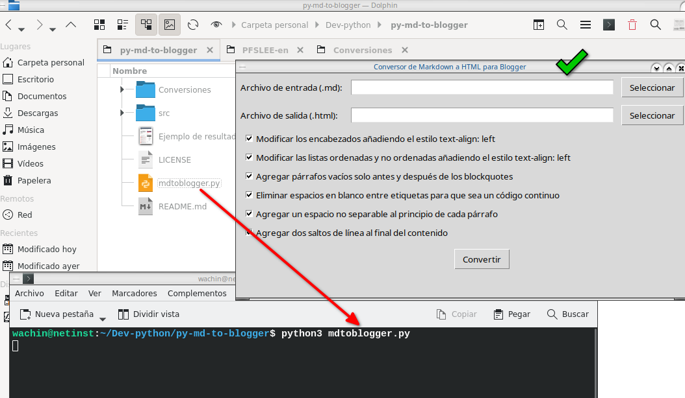

# py-md-to-blogger
# Manual de Usuario: Conversor de Markdown a HTML para Blogger

## Descripción
Este programa convierte archivos Markdown (.md) a HTML optimizado para Blogger, incluyendo una caja de código personalizada.

## Requisitos Previos
Para sistemas Linux basados en Debian o Ubuntu, necesitas instalar las siguientes dependencias:

```
sudo apt install python3-bs4 python3-markdown python3-tk tk-dev
```

## Consejos para tener en cuenta en el archivo markdown
1.- Cuando usted copie ejemplo un codigo así

```python
import requests

def check_requests():
    try:
```

borrele el python para que quede así:

```
import requests

def check_requests():
    try:
```

lo mismo haga si ve la palbra:

bash

borrela

porque después en la conversión se pasa al código y no le funcionará lo que copie de la caja

2.- Cuando vea una lista que no esté hecha de viñetas y estén juntas las palabras, ejemplo:

/home/wachin/Descargas
/home/wachin/Documentos
/home/wachin/Escritorio
/home/wachin/Música
etc

al final de cada línea coloque dos espacios vaciós:

/home/wachin/Descargas
/home/wachin/Documentos
/home/wachin/Escritorio
/home/wachin/Música
etc

porque sino le aparecerá así:

/home/wachin/Descargas /home/wachin/Documentos /home/wachin/Escritorio /home/wachin/Música etc

Y esto también ocurrirá en Github, por eso es un buen consejo.

## Instalación
1. Asegúrate de tener Python 3 instalado en tu sistema.
2. Instala las dependencias mencionadas en los requisitos previos.
3. Descarga el script del conversor en tu computadora.

## Uso del Programa

### Inicio
1. Abre una terminal en la carpeta donde se encuentra el script.

2. Ejecuta el programa con el comando:
   ```
   python3 mdtoblogger.py
   ```
   
3. Se abrirá una ventana con la interfaz gráfica del conversor:



### Selección de Archivos
1. **Archivo de entrada (.md)**: 
   - Haz clic en "Seleccionar" junto a "Archivo de entrada (.md)".
   - Se abrirá automáticamente la carpeta "Conversiones" en la raíz del proyecto.
   - Elige tu archivo Markdown.

2. **Archivo de salida (.html)**:
   - El campo se llenará automáticamente con el mismo nombre del archivo de entrada, pero con extensión .html.
   - Si deseas cambiarlo, haz clic en "Seleccionar" junto a "Archivo de salida (.html)".

### Opciones de Conversión
Puedes personalizar la conversión con las siguientes opciones:

- [ ] Modificar los encabezados añadiendo el estilo text-align: left
- [ ] Modificar las listas ordenadas y no ordenadas añadiendo el estilo text-align: left
- [ ] Agregar párrafos vacíos solo antes y después de los blockquotes
- [ ] Eliminar espacios en blanco entre etiquetas para que sea un código continuo
- [ ] Agregar un espacio no separable al principio de cada párrafo
- [ ] Agregar dos saltos de línea al final del contenido

Todas las opciones están marcadas por defecto. Desmarca las que no desees aplicar.

### Proceso de Conversión
1. Una vez seleccionados los archivos y configuradas las opciones, haz clic en el botón "Convertir".
2. El programa procesará el archivo Markdown y generará el HTML correspondiente.
3. Cuando la conversión se complete, verás el mensaje "Conversión completada" en la parte inferior de la ventana.

### Resultado
- El archivo HTML generado se guardará en la ubicación especificada en "Archivo de salida (.html)".
- Este archivo estará optimizado para su uso en Blogger, incluyendo una caja de código personalizada para los bloques de código.

## Características Especiales
- **Caja de Código Personalizada**: Los bloques de código en el Markdown se convertirán en una caja de código con estilo personalizado para Blogger.
- **Conversión de Texto entre Acentos Graves**: El texto entre acentos graves (`) se convertirá a negrita en HTML.

## Solución de Problemas
- Si encuentras algún error, asegúrate de que todas las dependencias estén correctamente instaladas.
- Verifica que los archivos de entrada estén en formato Markdown (.md) válido.

## Notas Adicionales
- Es recomendable revisar el HTML generado antes de publicarlo en Blogger para asegurarte de que el formato sea el deseado.
- Para cualquier problema o sugerencia, por favor contacta al desarrollador.

---

Este manual proporciona una guía completa para que los usuarios puedan instalar, configurar y utilizar este programa de conversión de Markdown a HTML para Blogger. Puedes ajustar o expandir cualquier sección según las necesidades específicas
